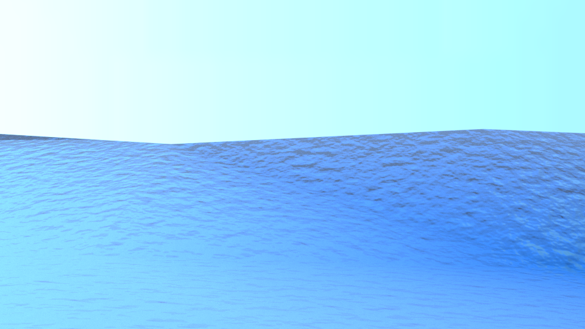
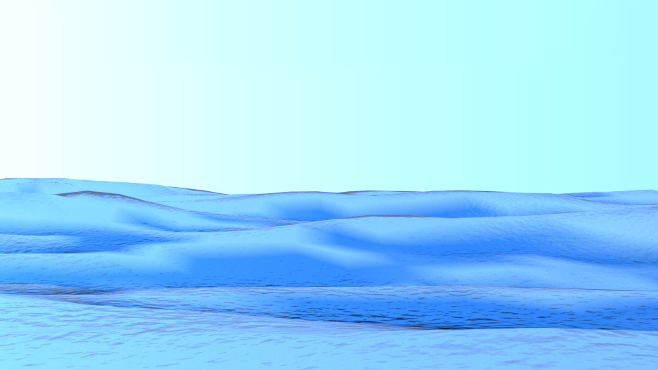
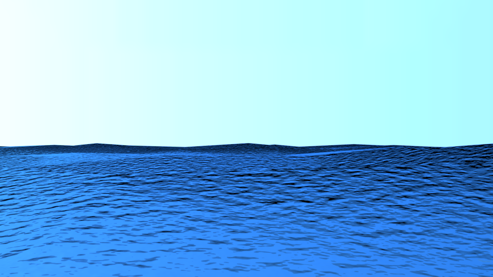
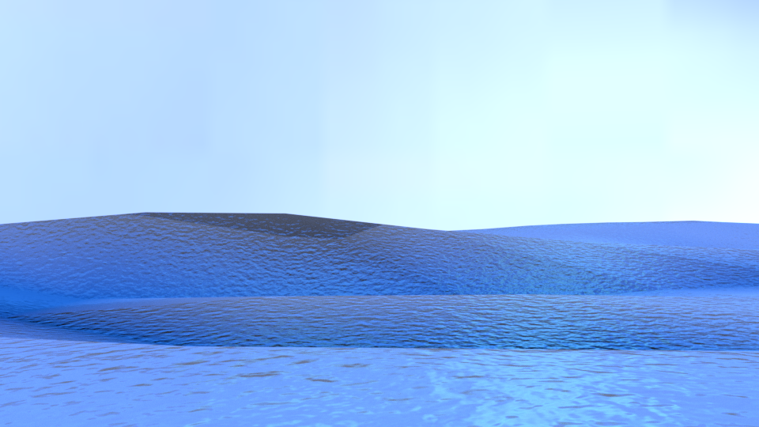
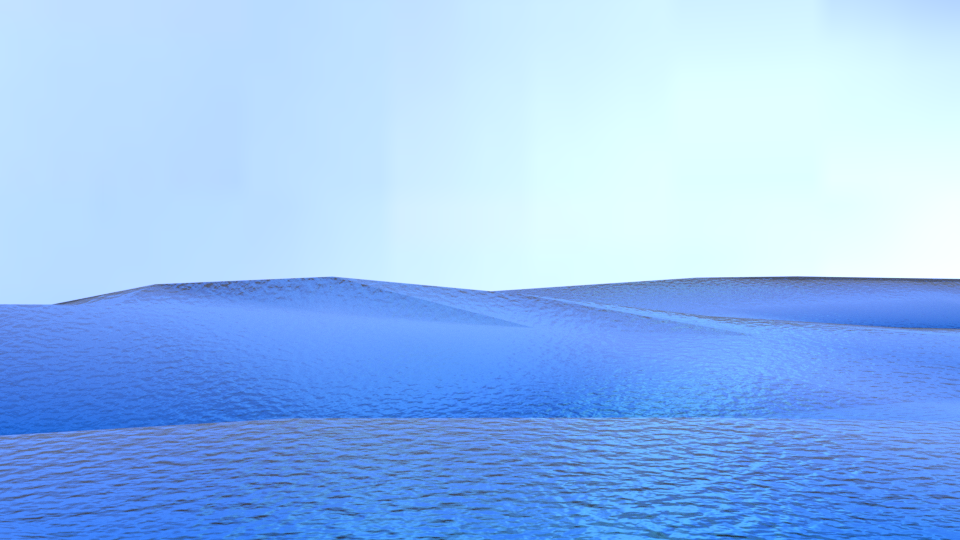

# Ship-simulator
# User instructions
The instructions for directly using the program are summarized here:
- Install bpy package for Python (Blender as a python module), available at pip application (just do pip install bpy). Documentation if needed: https://pypi.org/project/bpy/ 
- Download all the files from git: https://github.com/manubatet/Ship-simulator.
-It has to be taken into account that it is not directly executed by python, it is executed by Blender. So open the terminal and go to the 4macro.py file.
-Create a folder named 'data' (in the same path where 4macro.py is) where the different episodes will be saved.
-Once there you have to know the location of blender's app. It is usually in your installation folder and it depends on where did you installed it. You have to execute the blender's app with the terminal. Blender execute python also, so an example for the execution will be:

/Applications/Blender/blender.app/Contents/MacOS/blender -b -P 4macro.py

where -b means background execution and -P means python language

Please note that blender.app/Contents/MacOS/blender is for mac's case, usually its enough to refer the application (do not confuse it with the application folder)

# Brief description
I built a simulator using Python and Blender that generates 96x54 pixels images seen from a stabilized camera placed at the top of a boat, and simultaneously logs, according to different sea currents, the boat pitch and roll angles.
The boat is floating (i.e., not navigating, in the initial simple setting) according to a simple simulation as a cube aligned with the sea surface. 
The simulator allows to configure several parameters in order to change the scenario, the main are:
- wave choppiness
- wind velocity and wind-wave alignment, 
- sea depth (influences the height of the wave)
- camera position (height and angle) in the boat
- image frequency and resolution
A wide explanation of the program can be found in ENSTA_ShipSimulator.pdf

# Examples
## First example: Different parameters

## Second example: Temporal sequency

# VideoMaker.py
This is the program to make videos of the different episodes. You have to specify the folder of the episode and the folder where you want to save the video.
Example (done in the same path as data folder is):
python3 VideoMaker.py -i data/2021204820 -o data/20190421204820
